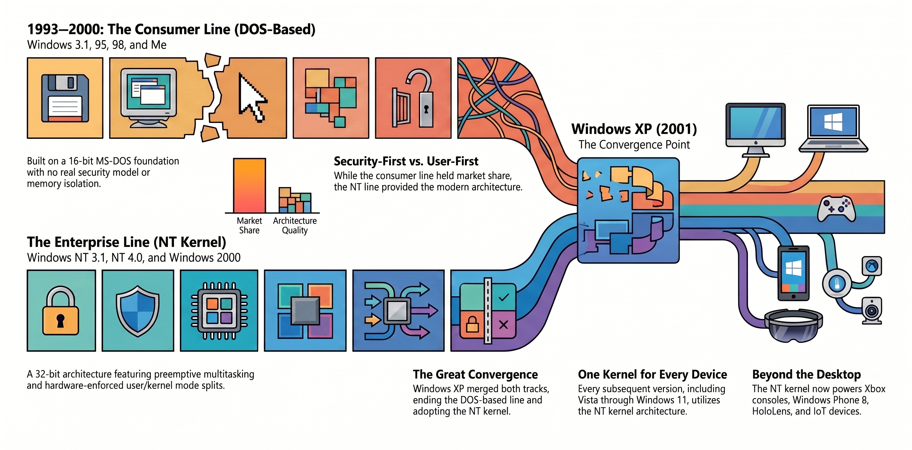
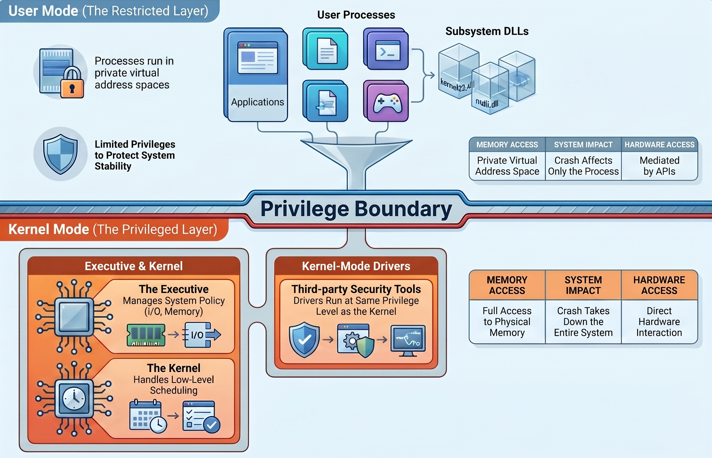
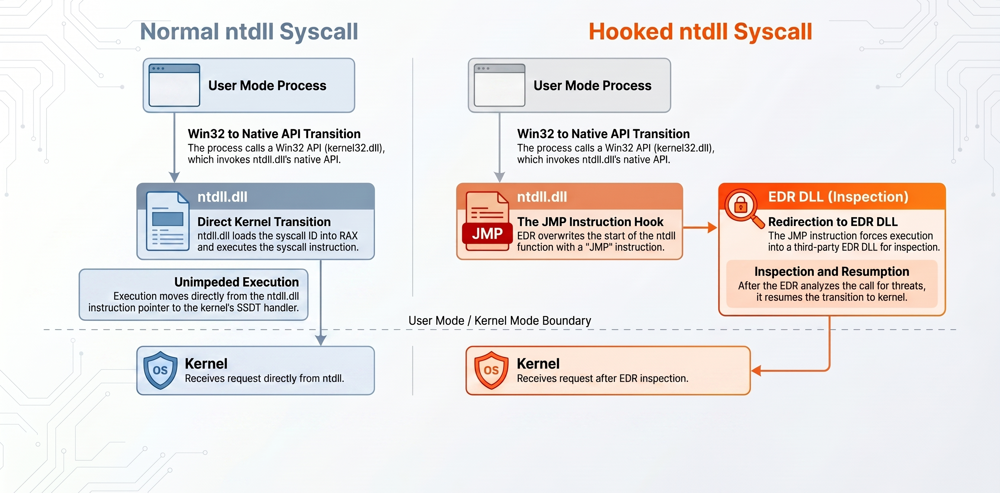
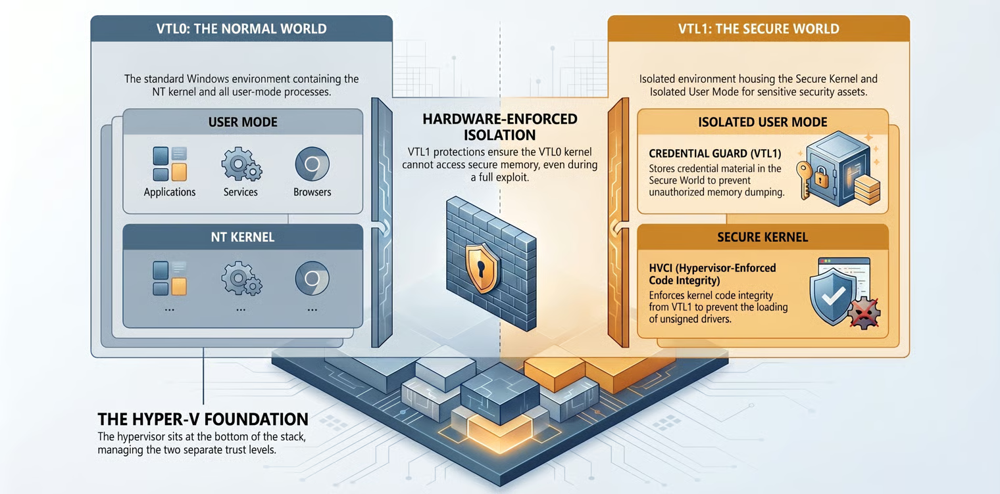

# Windows Internals

### Introduction

This is the start of a series on Windows internals with an offensive focus. The architecture and concepts that actually matter when you're doing red team work or building your own tooling. This first page is the why. The upcoming posts are the how.

I spent a long time attacking Windows without really knowing how it worked underneath. Knew the attack chains, could get through labs, understood AD well enough to chain things together. But the actual internals, memory, processes, what the kernel is actually doing when you call an API, I never touched that.

When I started moving toward red teaming that gap became a real problem. So I went and actually learned it. And it changed how I think about Windows completely.

Before going deep on this I genuinely thought Windows security was Microsoft shipping half-baked mitigations as an afterthought. After getting into the internals I realized that take was just wrong. The architecture is legitimately complex, and a lot of what looks like bad security design is actually the cost of decisions made decades ago that can't be cleanly undone. What's more interesting is that almost every security control Windows has today exists specifically to patch over attack surface those old decisions created. And attackers have responded to every single one of them by finding a signed, legitimate artifact that crosses the new boundary.

That pattern, architectural decision creates attack surface, Microsoft adds boundary, attackers find the key Microsoft left in the lock, is what this post is actually about. Not just what NT architecture looks like. What it means that it looks that way.



### History of Windows and the NT Kernel

Most people think of Windows as one thing. It wasn't always that way.

#### Two Tracks

Two OS lines in the early 90s. Consumer side was Windows 3.x through Me, all of it sitting on top of MS-DOS, no real memory isolation, no security model worth mentioning. Then NT 3.1 in 1993, completely different kernel written by Dave Cutler who came from DEC, 32-bit from day one, real memory isolation between processes, user/kernel split enforced at the hardware level, an actual security model built around access tokens.

They ran parallel for most of the decade. XP in 2001 merged them. Every Windows release since is NT underneath.

That lineage matters because the architecture you're attacking today has a direct line back to 1993. Core design decisions from that kernel are still in Windows 11. Which is exactly why code from the leaked Windows 2000 source tree, compiled in 1999, had a direct line to CVE-2025-24993, an NTFS heap overflow that CISA added to the Known Exploited Vulnerabilities catalog in March 2025. Twenty-five years. Same code. Active exploitation.

<figure><figcaption></figcaption></figure>

***

### Architecture Overview

User mode processes at the top. When a process needs the OS to do something it calls into subsystem DLLs, usually Win32, `kernel32.dll`, `user32.dll`. Those calls funnel down to `ntdll.dll`, last stop in user mode. ntdll translates the call to a syscall number and fires the syscall instruction into kernel mode.

On the kernel side that lands in the NT executive inside `ntoskrnl.exe`. Below the executive is the NT kernel itself handling scheduling and interrupts. Alongside everything are kernel-mode drivers at the same privilege level as the kernel. At the hardware boundary is HAL. And on modern Windows 10/11 systems, underneath all of it, is the Hyper-V hypervisor.

<figure><figcaption></figcaption></figure>

***

### User Mode and Kernel Mode

Two modes, enforced at the hardware level by the CPU.

User mode is where your processes live. Private virtual address space, limited privileges, one process can't directly touch another's memory. Crash in user mode, that process dies.

Kernel mode has full access to everything. Physical memory, hardware, every running process. Crash here and the whole system goes down.

<figure><figcaption></figcaption></figure>

> The user/kernel diagram above shows the boundary. Notice there's no SYSTEM label anywhere on it. That's the point.

Most practitioners think about Windows privilege as a single ladder. User, Administrator, SYSTEM, done. That model is wrong and it's the reason people hit walls they don't understand.

SYSTEM is the highest token-based privilege. But the user/kernel boundary doesn't care about tokens. A SYSTEM process and a standard user process are both in user mode. Both on the same side of that line. When I first tried to kill a **Protected Process Light (PPL)** process with a SYSTEM token it just failed. No access. That made no sense to me until I understood that PPL is a completely separate protection dimension enforced by the kernel's object manager, not by the token system. Your SYSTEM token is irrelevant to it.

That's the thing internals teaches you that tooling doesn't. You can have every token privilege in the book and still be completely unable to touch certain processes because the boundary stopping you isn't the one you're thinking about. Knowing which boundary you're actually hitting stops you wasting time on approaches that can't work by design.



### The Components

#### Processes and Threads

A process is a resource container, not the program. Private virtual address space, handle table, access token defining its security context, at least one thread. Two processes can both have a VA at `0x00400000` pointing at completely different physical memory. The memory manager enforces that separation.

Threads are what actually runs. Each has its own stack, its own register state, its own priority. Context switch happens, scheduler saves the outgoing thread's register state, restores the incoming thread's, execution continues exactly where it left off.

Process injection, remote thread creation, thread hijacking, all of it works directly against these primitives. Understanding what a process actually is makes the mechanics obvious instead of magic.



#### The NT Executive

Upper layer of `ntoskrnl.exe`, where OS policy lives.

Memory Manager handles virtual memory, page tables, page faults, allocation, protection of memory regions. Every `VirtualAlloc` call, every RWX region, every injected DLL goes through it. It also tracks private vs shared memory, which is exactly how EDRs identify anomalous allocations. A private RWX region with no backing module is a strong signal. The Memory Manager is what makes that signal visible.

Process Manager handles process and thread object creation and termination. CreateProcess fires, the process manager sets up kernel-side objects before the image starts loading. This is one of the most heavily instrumented points in the OS because it's where kernel callbacks notify security products about new processes.

I/O Manager handles all I/O. File operations, device communication, network traffic. Also manages the driver stack.

Object Manager maintains the kernel object namespace. Processes, threads, files, events, mutexes all live here. When you open a handle to anything the object manager resolves the name, checks access, returns the handle. This is also what enforces PPL. When your SYSTEM process calls `TerminateProcess` on a PPL-protected target, the object manager checks the protection level of the caller against the target and refuses. Token doesn't matter. Protection level does.

Security Reference Monitor enforces access control. Token impersonation, privilege escalation, access token manipulation are all attacks against what the SRM enforces, but PPL sits outside the SRM entirely. Different system, different bypass required.



### Subsystems and APIs

User mode code doesn't call into the kernel directly. It goes through a layered API system.

Win32 API is what matters most for offensive work. It's the oldest API set, shipped with the NT kernel from the beginning, and what most Windows programs use. `VirtualAlloc`, `CreateProcess`, `OpenProcess` are all Win32.

COM is used for object-based APIs like DirectX and WMI. More relevant for living-off-the-land techniques and certain persistence mechanisms.

.NET wraps Win32 APIs behind a managed runtime. Most modern offensive C# tooling and C2 implants live here.

WinRT is Microsoft's cross-platform API for modern Windows apps. Not particularly relevant unless you're specifically targeting UWP applications.

Win32 is the layer that matters. And Win32 eventually flows through ntdll.



#### The Design Decisions That Still Matter

NT 3.x had the GUI subsystem running in user mode. NT 4.0 moved the window manager and GDI into kernel mode as win32k.sys, purely for performance reasons. That one decision handed the kernel a GUI attack surface it never needed to have.

Win32k has been one of the most consistently exploited kernel components ever since. CVE-2025-24983, a use-after-free in the Win32k subsystem, was actively exploited in the wild and patched in March 2025 Patch Tuesday. The GRFX subcomponent of win32k alone produced multiple use-after-free and heap overflow bugs throughout 2024 and 2025. Microsoft has been trying to walk this back for years, Win32k syscall filtering lets sandboxed processes block win32k calls entirely, font parsing got moved out to user-mode sandboxes. The surface is smaller than it was in the Windows 7 era. It's still producing KEV-listed CVEs in 2025.

The backwards compatibility requirement is the other side of this. APIs introduced in 1996 are still present in Windows 11. Attack surface on Windows doesn't disappear, it accumulates. Old techniques work on unpatched systems because the code they target is still there.

### The Syscall Flow

Call `VirtualAlloc` from `kernel32.dll`. kernel32 validates parameters then calls `NtAllocateVirtualMemory` in ntdll. ntdll loads the syscall number into RAX, fires the syscall instruction. Execution transitions to kernel mode. Kernel reads the number from RAX, looks it up in the SSDT, calls the matching kernel function. Function does the work, returns.

<figure><figcaption></figcaption></figure>

> Not every API needs this trip. String operations and math run entirely in your process without touching the kernel. Only operations that require privilege, memory allocation, file I/O, process creation, handle operations, go through the boundary.



### What This Means Offensively

Most user-mode EDR hooks sit in ntdll. They overwrite the first bytes of functions like `NtAllocateVirtualMemory` with a JMP that redirects into the EDR's monitoring code before the syscall fires. Direct syscalls bypass this completely. Skip ntdll, load the syscall number yourself, fire the instruction. The hook never runs

<figure><figcaption></figcaption></figure>

But that's not enough anymore and treating it as a complete solution is a mistake. Kernel callbacks like `PsSetCreateProcessNotifyRoutine` fire regardless of how the syscall was made. The EDR doesn't need to see the ntdll call because the kernel tells it directly. Call stack validation adds another layer, a syscall from heap-allocated unbacked memory is a strong signal even if ntdll was never touched.



So you need kernel access. That's where BYOVD comes in. You can't load an unsigned driver on a modern Windows system with HVCI enabled. But you can load a legitimately signed driver with a known vulnerability, an old anti-cheat binary, a hardware monitoring tool. HVCI lets it load because it's signed. You exploit the vulnerability in it, get kernel execution from there. Once you're in kernel space you can zero out the callback array entries that notify the EDR about process creation, image loads, thread creation. The EDR keeps running, it just stops receiving events. From a detection standpoint it looks like a quiet system.

A single BYOVD campaign targeting the TrueSight driver deployed over 2,500 driver variants between mid-2024 and early 2025. By February 2026 Reynolds ransomware was embedding the vulnerable driver directly inside the ransomware payload, no separate deployment step needed.

<figure><figcaption></figcaption></figure>

Microsoft's answer to kernel-level attackers was VBS. Put Credential Guard and HVCI in VTL1, a separate execution environment the VTL0 kernel itself cannot inspect. Even a full kernel exploit in VTL0 can't read credential material stored in VTL1. Even BYOVD kernel execution can't load unsigned drivers if HVCI enforces from VTL1.



And then in early 2025, Akamai and Outflank published research on BYOVE, Bring Your Own Vulnerable Enclave. Same pattern as BYOVD, new target. Load a legitimately signed but vulnerable enclave module, exploit it to get VTL1 code execution, store your payload in VTL1 memory where even kernel-level EDRs cannot inspect it. Outflank shipped it as a production sleep mask in their C2. Akamai's Mirage technique, presented at DEF CON 33 in August 2025, parks shellcode in VTL1, periodically pulls it back to VTL0 for execution then erases it, making memory scans during dormant stages find nothing.



The pattern hasn't changed since NT 4.0 moved win32k to kernel mode. Every boundary Microsoft adds, attackers find a signed, legitimate artifact that crosses it. Driver signing enforcement, use a vulnerable signed driver. VTL1 isolation, use a vulnerable signed enclave. The attacker doesn't break the wall. They find the key Microsoft left in the lock.

That's what NT architecture means offensively. And it's still running.

### From Here

The rest of the series is what you do with it. Each part takes one piece of this architecture and goes deep enough that you could actually build something with it or break something because of it. Start with processes.
