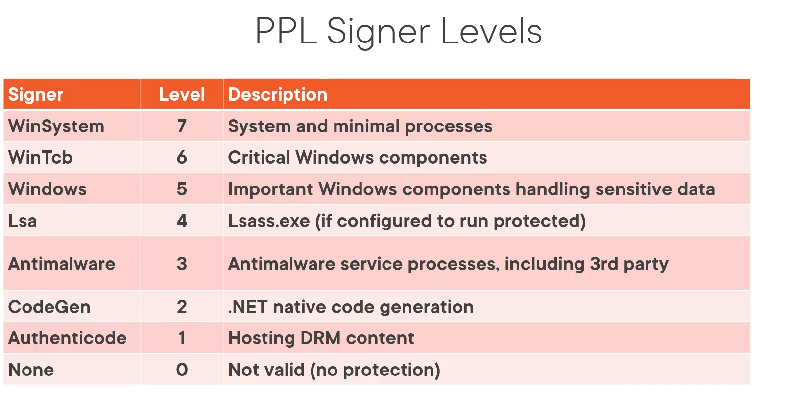
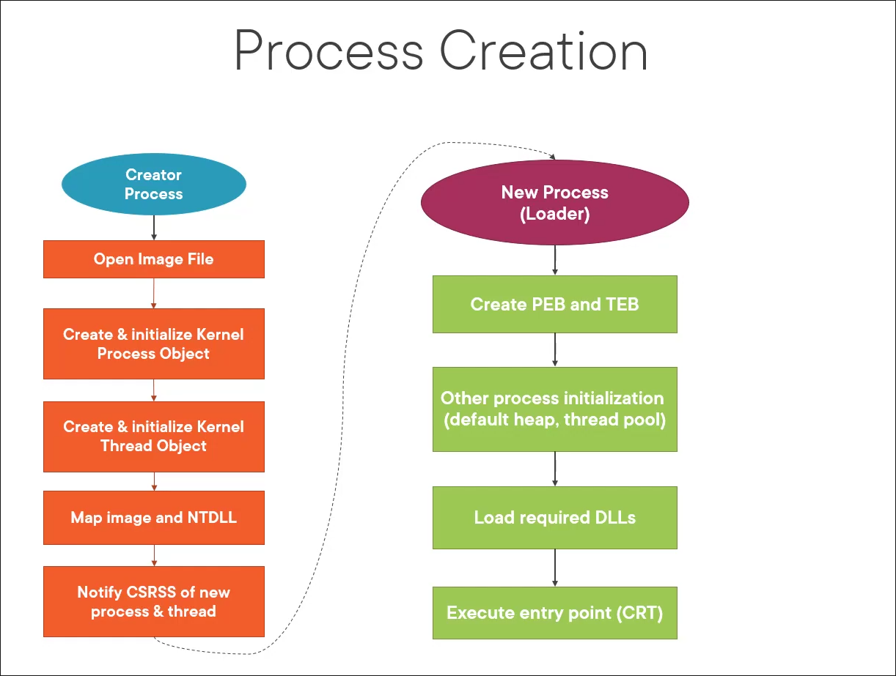

# Part 1: Process Internals

### Introduction

From the previous post you should have enough idea about how the whole Windows NT architecture is structured as a whole and why the Kernel mode and User mode separation is important for security.&#x20;



In this post we will dive into the hierarchy and abuse of processes in Windows. There is a whole layer abstraction that a user doesn't see while normally using Windows and it is intentionally like that so user doesn't need to care about what is going under the hood. Process is a big topic so I will take it from the definition, explanation, components to usage of APIs and in the end we will discuss the offensive angle.

### What is a Process

Many think that a process is just the "code running" and doing the tasks but it is not true. In fact process is not even executing the code itself. This brings the question on what a process actually is then ?

In Windows a Process is just a set of resources allocated to an application to perform tasks. It holds the private address space, executable image, private handle table, access token and threads for the application that process belongs to. Together these resources form a process that interacts with the kernel space through a set of APIs.



### Process Components

As a process consists of multiple components it is crucial to dive deeper into each of those to better understand a process

#### Private Address Space

When an executable is launched its code along with other memory related things like DLLs is loaded into a private memory space that is specifically allocated for that program. Every process has its own private space which is isolated and is not mixed up with other processes. [VMMap](https://learn.microsoft.com/en-us/sysinternals/downloads/vmmap) can show the private address space for a process as shown below.

<figure><figcaption></figcaption></figure>

For example, in this notepad application this private address space holds the temporary data that is being written in it along with its code. The memory concepts themselves will be covered in its own post as it is a much bigger topic and this is just for Private Address Space concept itself.

> **Note:** The private address space of a process is not the actual physical memory address but instead these are virtual addresses that are mapped to Physical addresses by the memory manager.



#### Executable Image

Mostly Processes have an executable image associated with them that contains the initial code required by the application to start. It contains the main function, global variables and the main code for the application. The most common type of executable are the `.exe`  and `.dll` files that are mapped to a process when it runs. VMMap provides the images of a process as well.

<figure><figcaption></figcaption></figure>

The above example shows the list of images associated with the notepad process when its running. The most prominent one is the `notepad.exe` itself which initiates the process along with other common dll files needed by the program.



#### Private Handle Table

Each process has its own handle table. From the user-mode perspective, this appears as a private collection of handles the process can use.

A handle is simply a numeric index (e.g. 0x4, 0x8) that the process uses to refer to kernel objects such as files, threads, processes, or mutexes.

When you call an API like `OpenProcess`, the kernel looks up or creates an entry in the process’s handle table (which actually lives in kernel space), performs the access check, caches the granted rights, and returns the handle value to user mode. All subsequent operations using that handle are validated against the cached access mask for performance. [Process Explorer](https://learn.microsoft.com/en-us/sysinternals/downloads/process-explorer) can be used to view the list of handles opened by a process

<figure><figcaption></figcaption></figure>


**Note:** Handle value itself (like 0x4, 0x8) isn't the object's identity, it's a per-process index, meaning handle 0x4 in process A and 0x4 in process B point to totally different objects.




#### Access Token

Whenever a process is created it has a set privileges that determine what a process is allowed to do on the system. These privileges are defined through a security kernel object known as Access Token. It contains the SID, User, Group, OS Privileges, Protection flag, session id, etc. Usually when a process is created it inherits the access token of the parent process. The access token of a process can be viewed in security tab of process properties in Process Explorer

<figure><figcaption></figcaption></figure>

The access token granted to a process also depends upon the integrity that process runs as. A security mechanism called **Mandatory Integrity Control (MIC)** enforces the object access depending upon the integrity of the token. When a process runs normally by an administrative user it runs with a medium integrity token that is filtered by **UAC** that doesn't give full administrative privileges to the process even if the user belonged to administrator group. If a high integrity token is needed to perform actions that require full administrative rights the **User Access Control (UAC)** mechanism is called which opens up a consent prompt to spawn process with elevated access. UAC requests a high integrity token from the OS and assigns it to the process which then allows the process to use all the administrative rights and privileges that were not available on medium integrity token.



#### Threads

Each process contains one or more threads. These threads are the actual component inside process that executes the code and utilizes the resources available to the process. Threads are scheduled for execution by the kernel and executed by the CPU. Each thread has a set of states that it needs to maintain in order to function properly.

CPU has a limited number of threads it can execute simultaneously and a proper scheduling mechanism is required to execute threads that gives fair amount of time to each thread to execute. If a thread needs to execute longer than its scheduled time its register values are saved so when the thread again gets the chance to execute it continues the execution where it left based on the stored register values as the CPU has to reset the registers for other threads to execute.



Furthermore, a thread comprises of different components including scheduling state, stacks, Thread Local Storage (TLS), Security token, Message queue (if GUI thread), and whether the thread is in user mode or kernel mode.

Each Process has at least one thread when it is executed and it executes the main code. We can observe a thread when it is executing to see at any point in time what the thread is doing on the system. [Process Monitor](https://learn.microsoft.com/en-us/sysinternals/downloads/procmon) from Sysinternals suite can be used to view the properties of a thread stack and get an idea about what a thread might possibly be doing when a particular event is triggered.

<figure><figcaption></figcaption></figure>

Above image shows the thread stack captured for the CreateFile event triggered when we open a file in Notepad. We can see the call goes from `ZwOpenFile` in user mode into the kernel, hitting `NtOpenFile` and eventually `NtCreateFile`.

Now you might be thinking, we opened a file, why is `NtCreateFile` showing up here. Turns out `NtOpenFile` and `NtCreateFile` are separate syscalls, but under the hood they both share the same core kernel logic for handling files, since opening and creating a file both need the same groundwork done, path resolution, security checks, setting up the file object. The two only really differ in what disposition gets passed in. So seeing `NtCreateFile` in the stack doesn't mean anything got created, it's just the shared internal code.



### Process in Kernel Space

Every process created in user mode also has a corresponding structure in kernel space that the Windows kernel uses to manage it, called **EPROCESS**. **EPROCESS** wraps another structure, **KPROCESS** (also known as the **Process Control Block**), which holds the scheduling and dispatcher-related fields the kernel needs to actually run the process's threads. All **EPROCESS** structures are linked together in a doubly linked list tracked by **PsActiveProcessHead**, letting the kernel walk every active process on the system.&#x20;

On the user-mode side, each process also has a **Process Environment Block (PEB)**, sitting in the process's own address space so the process itself can read data like its loaded modules without needing a kernel transition. Together, **EPROCESS/KPROCESS** and **PEB** give you the full picture of a process.

<figure><figcaption></figcaption></figure>

### EPROCESS

**EPROCESS** itself is largely undocumented by Microsoft. There's no official structure reference for it, most of what's known comes from WinDbg symbols and community efforts like the Vergilius Project, along with resources like the Windows Internals book. Microsoft does expose a bit of tooling around it, like the `!process` and `dt` commands in WinDbg, but the structure itself is considered opaque and subject to change across Windows versions without notice.



The EPROCESS structure has well over 100 fields, most of which you'll never need to care about unless you're doing serious kernel research. If you want to see the full structure yourself, the Vergilius Project keeps an up to date breakdown for every Windows version. For this post we'll just look at a few fields that connect directly to what we've already covered and are worth knowing about from an operator's perspective.

#### Token&#x20;

**Token** is a pointer to the process's access token, wrapped in an `EX_FAST_REF` structure rather than a plain pointer. `EX_FAST_REF` packs a reference count delta into the low bits of the pointer alongside the actual token address so the kernel can track references without a separate counter field.

When the kernel performs an access check involving this process, it dereferences this exact field to get the token, checks the SIDs, integrity level, and privileges inside it, and makes its decision based purely on what that token contains. It doesn't verify that the token actually belongs to this process or came from a legitimate logon event. This is the fundamental reason token stealing works, which we'll cover in detail later.



#### ActiveProcessLinks

**ActiveProcessLinks** is a `LIST_ENTRY` containing two pointers, `Flink` and `Blink`, forming a circular doubly linked list that connects every EPROCESS on the system. The head of the list is tracked by the kernel symbol `PsActiveProcessHead`.

One thing to know is that these pointers don't point to the base of the next EPROCESS, they point specifically to the `ActiveProcessLinks` field inside it, so to get the actual EPROCESS base you subtract the field's offset from the pointer. This is how tools like Process Explorer walk the list and resolve individual process structures. Most process enumeration in both userland tools and some EDR components is done by walking this exact list, which makes it a target for DKOM-based process hiding.



#### Image File

**ImageFileName** is a 15 character null terminated byte array holding the short name of the executable. Most quick enumeration tools read this field rather than resolving the full image path, which is why it comes up in discussions around process name spoofing and detection gaps.

#### Process Environment Block (PEB)

**PEB** points to the Process Environment Block, which unlike everything else discussed here lives in the process's own user mode address space rather than kernel memory, so the process itself can read it without a kernel transition. The PEB holds things like the base address of the loaded image, the loader data listing all loaded modules, and environment variables.



#### Parent PID

`InheritedFromUniqueProcessId` stores the PID of the process that called `CreateProcess` to create this one. It's set directly by the kernel at creation time and doesn't change afterward. Windows allows a caller to set this to an arbitrary PID at creation time, which is the basis of PPID spoofing covered later.

#### Protection

**Protection** stores the process's protection level as a single packed byte defined by the `PS_PROTECTION` structure, with Type in bits 0 to 2 (unprotected, PPL, or full PP), Audit in bit 3, and Signer in bits 4 to 7, which identifies the signing authority, values like WinTcb, Lsa, Antimalware, each sitting at a different trust tier.

When a process calls `OpenProcess` on a PPL protected target, the kernel checks this field on the target's EPROCESS and compares the caller's own signer level against it. If the caller is lower, the call returns `STATUS_ACCESS_DENIED` immediately, before any handle is created, before any access mask is evaluated. This is why LSASS with RunAsPPL enabled can't be opened even from a process running as SYSTEM with `SeDebugPrivilege`, the privilege doesn't matter here, the signer level does.




You can inspect any of these live in WinDbg with `dt nt!_EPROCESS` against a running process.


### Protected Processes

Before Windows Vista, DRM was essentially broken at the OS level. Any user with enough privilege could open a handle to the media decoder process and read the decrypted content straight out of its memory. Microsoft introduced Protected Processes in Vista specifically to close that gap.

A Protected Process cannot be opened with an invasive handle by any user, including administrators. The kernel itself can access these processes freely, and so can other Protected Processes, but from user mode the door is shut regardless of your privilege level. The processes protected at the time were media-related ones like `Audiodg.exe`, `Mfpmp.exe`, and `Werfaultsecure.exe`.

Modern Process Explorer can still inspect modules and DLLs inside Protected Processes when run as administrator, because it loads a kernel driver to do it. The protection only applies to user mode access, not kernel mode.

**Protected Process Light**

Windows 8.1 extended this model with PPL, Protected Process Light, which introduced a tiered trust hierarchy rather than a simple protected or not protected binary. The trust tier of a PPL process is determined by its signer level, a value that identifies the signing authority behind the binary. WinTcb sits at the top, followed by Windows, then Lsa, then Antimalware, down to lower signer values from there.

<figure><figcaption></figcaption></figure>

The key rule is that a PPL process can open a handle to another PPL process only if its own signer level is equal or higher. A lower signer cannot open an invasive handle on a higher one. This is why LSASS with RunAsPPL enabled cannot be opened even by a SYSTEM process without a matching or higher signer level, SeDebugPrivilege does not factor into this check at all.

Like the original Protected Process model, PPL enforcement lives entirely in user mode. At the kernel level it is just a byte in EPROCESS. During kernel debugging you can modify the PPL level of any process directly in WinDbg, which is also exactly what BYOVD attacks do when they want to strip protection from a target process.



### Process Creation Lifecycle

Every process is born into an already running environment. By the time `CreateProcess` gets called there is already a session established, `csrss.exe` watching it, and `explorer.exe` owning the shell. The process being created is just a new addition, not something being built from scratch.

<figure><figcaption></figcaption></figure>

When `CreateProcess` is called, here is what actually happens before a single line of the new process's code runs.

First the kernel opens and validates the image file, checks it is a valid PE(Portable Executable), determines what kind of process it needs to be, a normal Win32 process, a WoW64 process if it is a 32-bit binary on a 64-bit system, and creates a section object mapping the image into memory. This section object is not the process yet, it is just the kernel's representation of the file ready to be mapped.

Next the kernel creates the process object. EPROCESS gets allocated and initialized, the private address space is set up, the handle table is created, and the access token is assigned, either inherited from the parent or explicitly provided via `CreateProcessAsUser` or `CreateProcessWithTokenW`.

Then the initial thread is created in a suspended state. No code runs yet. The kernel sets up both the user mode and kernel mode stacks and initializes the thread context so execution starts at the right place when it eventually gets scheduled.

At this point `ntdll.dll` gets mapped into the new process. This happens before any other DLL and before any user mode code runs. ntdll contains the syscall stubs, the loader, and the runtime support every Windows process needs. There is no Windows process without it.

The kernel then notifies `csrss.exe` via an internal ALPC call. csrss is the Win32 subsystem process and needs to know about every process created in its session to manage console behavior and shutdown notifications. Once csrss is notified, `CreateProcess` returns a handle to the caller.

The process still has not run anything. When the initial thread finally gets scheduled, the first thing that runs is not `main`, it is the loader inside ntdll. The loader maps all dependent DLLs, resolves the import address table, runs each DLL's `DllMain`, sets up the PEB and TEB, initializes the heap, and only after all of that does execution transfer to the CRT startup code which eventually calls `main`.



The whole thing from `CreateProcess` call to the first line of main is a surprisingly long chain of steps happening across both the kernel and user mode, across both the parent process and the newly created one, and across both the Windows executive and the Win32 subsystem. Understanding where each step happens and in what order is useful to know why something works

### Process APIs

Windows exposes a rich set of APIs for creating, managing, and interacting with processes. Most of these live in kernel32.dll and are thin wrappers that eventually call into ntdll which then transitions into the kernel via syscalls. Understanding what each of these does and where they sit in the call chain matters a lot offensively because EDRs hook these APIs at various layers to monitor suspicious behavior, and knowing which layer a hook lives at is what informs the decision of where to call from.

#### **Process Creation and Management**

`CreateProcess` is the standard Win32 API for spawning a new process. It takes the image path, command line, security attributes, handle inheritance settings, creation flags, environment block, and a startup info structure, and returns handles to both the new process and its initial thread. What most people don't think about is that `CreateProcess` is doing a lot more than just launching an executable, it's the entry point into the entire creation lifecycle we discussed earlier, and every parameter you pass directly influences how that lifecycle plays out. The creation flags alone control whether the process starts suspended, whether it gets a new console, whether it runs in a job object, and more. Attackers abuse `CreateProcess` most commonly by launching a legitimate process in a suspended state using the `CREATE_SUSPENDED` flag, which gives them a window to modify the process before its first instruction ever runs, this is the foundational primitive behind process hollowing and process doppelganging.



`CreateProcessAsUser` and `CreateProcessWithTokenW` are variants that accept an explicit token handle instead of inheriting the parent's token. The difference between the two is subtle, `CreateProcessAsUser` requires the caller to hold `SeAssignPrimaryTokenPrivilege` and `SeIncreaseQuotaPrivilege`, while `CreateProcessWithTokenW` is designed for use with tokens obtained through impersonation and has slightly different privilege requirements. Both are heavily used in post-exploitation for spawning processes under a different user's security context after obtaining their token through impersonation or token theft, letting an attacker run tools as a different user without needing their credentials directly.





`OpenProcess` is how you get a handle to an already running process. You specify the PID and the access rights you want, and if your token passes the access check and the target isn't PPL protected, you get back a handle with exactly those rights cached on it. The access mask you request here is critical, `PROCESS_ALL_ACCESS` is the most invasive and the most monitored, while more targeted masks like `PROCESS_VM_READ` or `PROCESS_VM_OPERATION` combined with `PROCESS_VM_WRITE` are the minimum needed for memory injection operations. EDRs pay close attention to OpenProcess calls that request write or execute-related access against sensitive targets like lsass.exe, which is why more evasive injection techniques try to avoid calling OpenProcess directly against the target at all.



`TerminateProcess` takes a process handle with `PROCESS_TERMINATE` access and kills the target. Straightforward on the surface but worth knowing that it's also abused to kill EDR or AV processes when an attacker has sufficient privilege, or to clean up injected processes after use.



### Simple Process Explorer

As we have discussed the APIs it is time to use some of them and see that in action. For this demonstration We will be coding a very basic CLI based process explorer that enumerates a given PID and provides the information related to that process.



Now for the demonstration of the code we will start notepad with normal privileges and inspect the process.

<figure><figcaption></figcaption></figure>

We can see from the above screenshot that by running notepad directly the integrity level of the process in medium and privileges are limited to `SeChangeNotifyPrivilege` only. This is normal for a process running with medium integrity and UAC filtered token.

Now we will run notepad as administrator and inspect its integrity and privileges.

> **Note:** The PowerShell instance should also be running with elevated privileges to inspect and elevated process. Make sure you run powershell as administrator as well.

<figure><figcaption></figcaption></figure>

Now from the above screenshot we can see the key differences in integrity and privileges given to the process. Now notepad is running with a high integrity, for privileges `SeImpersonatePrivilege` and `SeCreateGlobalPrivilege` is also enabled this time for the process.

This distinction matters when we think about a malware running with medium integrity and normal privileges and a malware running with high integrity and high privileges allowing the malicious program to do more damage than the first one. This privilege difference is exactly what an attacker targets post-exploitation, medium integrity limits what malware can do, which is why privilege escalation is always the next step after initial access.

### Leveraging the Process

As an operator you might be wondering how all this can be used and that is what we are going to discuss now. Long gone are the days when a malware used to run a separate process entirely without tripping the defenses. In modern threat landscape there is a continuous arms race going on between attackers and defenders. Attackers try to leverage Windows functionality into evading the defenses like EDR and AV solutions, One particular method that is still relevant is Process Injection where an attacker tries to inject shellcode into another process and execute it. It basically bypasses the need to create a separate process entirely and leverages an already running innocent process to execute shellcode. There are various techniques used to do process injection. Some of which are more evasive than others.



That is why modern EDRs now hunt for behavior heavily. A notepad making an outbound connection to a remote host over the network is suspicious and tells the EDR that a process injection might have been attempted on that process. Attackers try to cover up this behavior by thinking each step carefully and selecting a process that is known for making outbound connections and is always running by default like `onedrive.exe` or browser processes.

Getting the first callback is one thing but maintaining that access is more important as EDR continuously monitors and correlates the telemetry of the entire system hunting for suspicious activity from processes and memory.

**Token Theft**

Earlier we talked about how the kernel resolves your process's token by just de-referencing a pointer in EPROCESS and trusting whatever it finds there. That same mechanic is what makes token theft so effective at the API level too, without ever touching kernel memory.

When an attacker lands on a box and their process has `SeDebugPrivilege` available, they can call `OpenProcess` against a SYSTEM level process, open a handle to its token via `OpenProcessToken`, duplicate it with `DuplicateTokenEx`, and then either impersonate it on the current thread or hand it to `CreateProcessWithTokenW` to spawn a new process running entirely as SYSTEM. Every single one of those is a documented, legitimate Windows API. The abuse is just calling them in the right order against the right target and weaponizing them.



**Handle Duplication**

One thing worth knowing is that you do not always need to call `OpenProcess` against a sensitive target directly. If another process on the system already has an open handle to something like lsass, you can duplicate that handle into your own process using `DuplicateHandle` without ever touching lsass yourself. Solutions that specifically watch for `OpenProcess` calls targeting sensitive processes will miss this entirely because from their perspective you never opened a handle to anything suspicious. You just borrowed one that was already sitting there.



**Process Hollowing**

`NtUnmapViewOfSection` is an NT-level API that unmaps a previously mapped view of a section object from a process's address space, effectively carving out a region of memory from the target process.

In practice this is the primitive behind process hollowing. The technique is straightforward: spawn a legitimate process in a suspended state using `CREATE_SUSPENDED`, unmap its original executable image from memory, write your own image into that address range, patch the entry point in the thread context to point at your code, then resume the thread. From the outside the process looks completely clean. Right name, right path on disk, right parent in the process tree. What is actually executing inside it is entirely yours. The PEB still shows the original image name, `EPROCESS.ImageFileName` still shows the legitimate binary, and unless the defender is doing memory scanning and comparing what is on disk against what is mapped in memory they will not catch it from process metadata alone.



**PPID Spoofing**

We know that `EPROCESS.InheritedFromUniqueProcessId` stores the parent PID and that it can be set to anything at creation time via `PROC_THREAD_ATTRIBUTE_PARENT_PROCESS`. The practical value of this is that a lot of behavioral detections are built on process tree relationships. A cmd.exe spawned by your implant looks suspicious. The same cmd.exe appearing to have come from explorer.exe looks like a user opened a terminal. One attribute set at process creation time is the difference and it costs nothing. Detections that cross reference the reported parent against other telemetry like handle inheritance or session boundaries can catch this, but ones that just look at the tree at face value will not.



**DKOM Process Hiding**

Every userland enumeration tool, Task Manager, Process Explorer, gets its process inventory by walking `ActiveProcessLinks`. The kernel exposes this through `NtQuerySystemInformation` which itself just walks that same list. If you have kernel write primitives, you can remove a process from that list entirely by patching the `Flink` of the previous entry and the `Blink` of the next entry to skip over your process. From that point forward nothing walking the list will see it. Task Manager won't show it, and weak incident response tooling will miss it completely.

The process itself keeps running. The scheduler doesn't use `ActiveProcessLinks`, it works off dispatcher structures inside KPROCESS, so your unlinked process continues executing, consuming CPU, making network connections, doing whatever it was doing. It's just invisible to anything that enumerates via the list.

The catch is that not everything relies on `ActiveProcessLinks`. Handle-based enumeration, csrss internal tracking, and some EDR kernel callbacks that register directly for process create and terminate events will still see the process regardless of what you do to the list.



**BYOVD**

The Protection byte in EPROCESS is the entire enforcement mechanism behind PPL. There's no secondary check and no kernel callback verifying it hasn't been tampered with. It's just a byte in kernel memory. If you can write to kernel memory, you can zero it out, and from that point the process behaves as completely unprotected regardless of what signer level it was originally assigned.

This is the primitive behind **Bring Your Own Vulnerable Driver** attacks targeting protected processes. A signed but vulnerable driver gets loaded because it passes signature verification, the attacker exploits an arbitrary write primitive inside it to locate the EPROCESS of the target, patches the Protection field to zero, and then opens a handle to it from userland normally. LSASS with RunAsPPL, Defender, any PPL protected process becomes accessible this way. The kernel never detects the patch because there's nothing watching that field.

Microsoft's response to this has been the vulnerable driver blocklist, maintained through Windows Defender and now enforced at the hypervisor level via HVCI on supported hardware. HVCI makes kernel memory read-only after boot for code pages, which raises the bar significantly, but the arms race around the driver blocklist itself is ongoing.



**Why Any of This Matters**

The reason operators need to understand process internals at this level is not just to run techniques. It is to understand why they work and more importantly why they sometimes do not. Every defensive mechanism you will run into, ETW tracing, kernel callbacks, handle auditing, memory scanning, is built on the exact same structures we covered in this post. EPROCESS, the token, the handle table, the PEB. Defenders instrument those structures to get visibility. Attackers abuse those same structures to execute. The better you understand the substrate the better you understand both sides of that equation.

